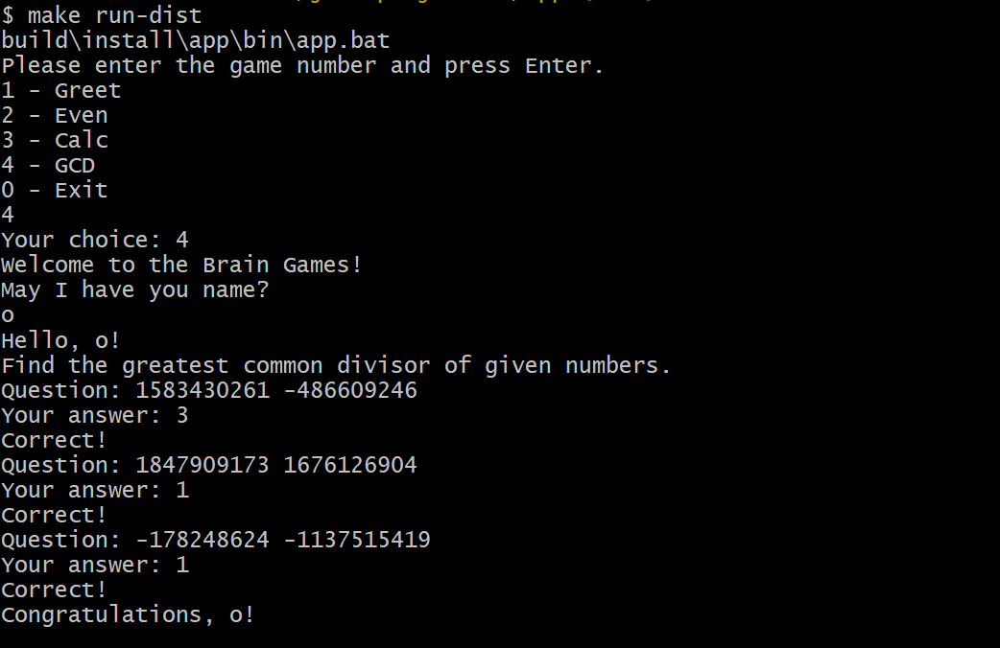
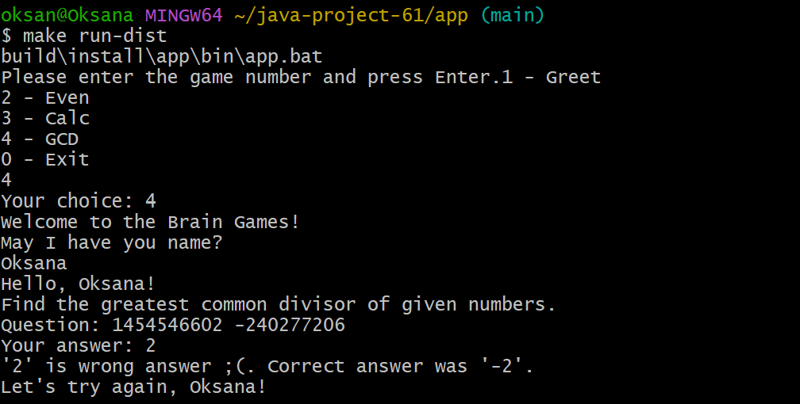
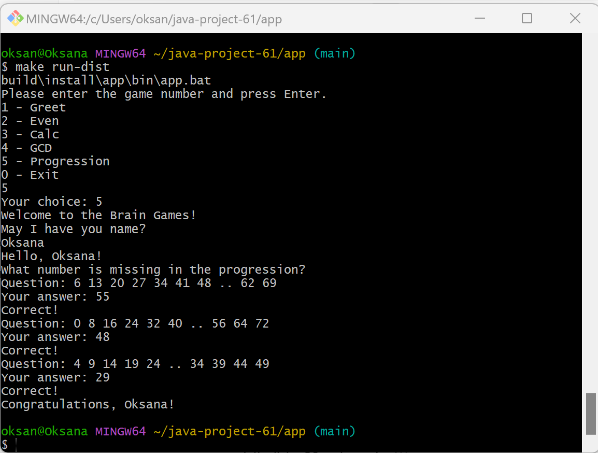
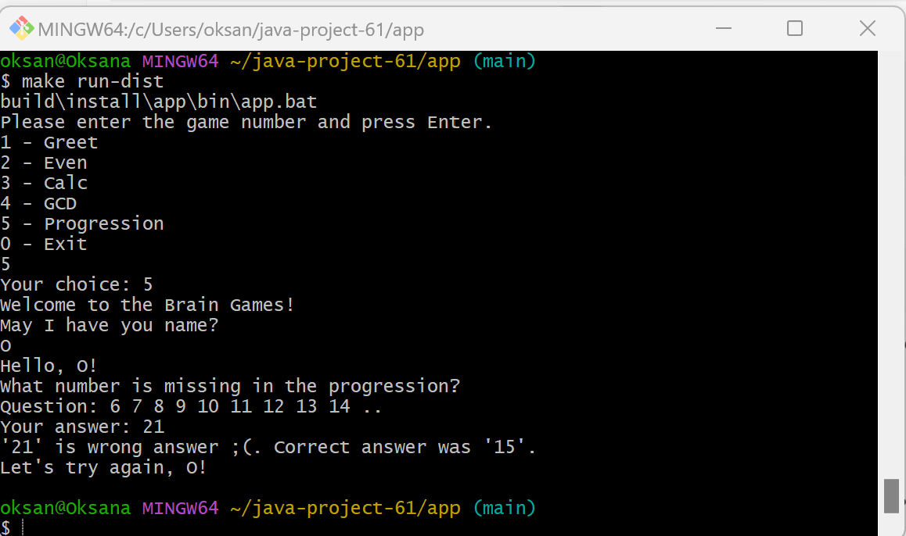
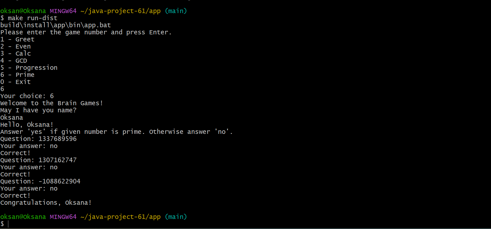
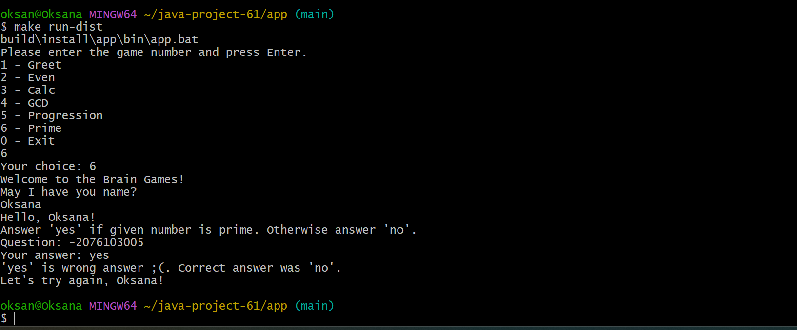

### Hexlet tests and linter status:
[](https://github.com/oksanaryzhova8/java-project-61/actions)

[](https://sonarcloud.io/summary/new_code?id=oksanaryzhova8_java-project-61)

Brain Games

Brain Games is a console application that includes five mathematical games. To win, the player must give three correct answers in a row.

The project contains the following games:

* Even — determine whether a number is even.
* Calc — calculate the result of an arithmetic expression.
* GCD — find the greatest common divisor.
* Progression — find the missing number in a progression.
* Prime — determine whether a number is prime.

## Requirements

* Java 21

## Installation

Clone the repository and open the application directory:

```bash
git clone https://github.com/oksanaryzhova8/java-project-61.git
cd java-project-61/app
```

## Run

In Git Bash or Linux:

```bash
./gradlew run
```

In Windows PowerShell or Command Prompt:

```powershell
gradlew.bat run
```

After starting the application, enter the number of the desired game and press Enter.

## Even game demonstration
### Victory

### Defeat


## Calc game demonstration 
### Victory

### Defeat


## GCD game demonstration
### Victory

### Defeat


## Progression game demonstration
### Victory

### Defeat


## Prime game demonstration
### Victory

### Defeat

